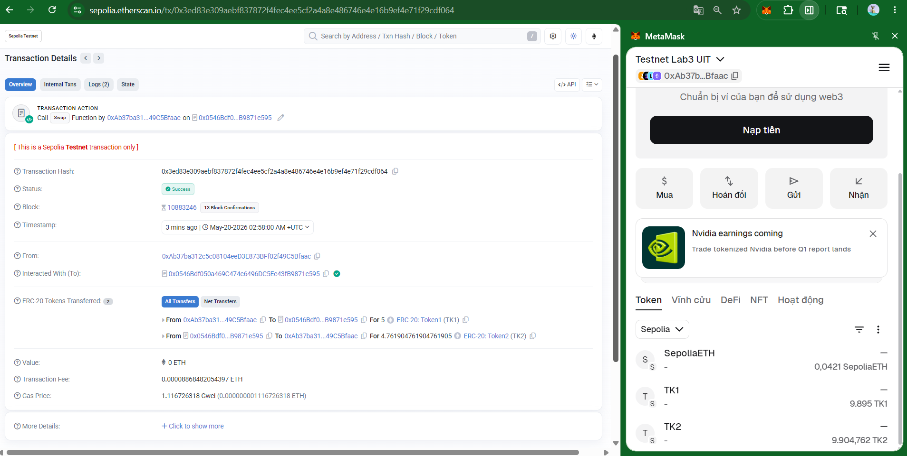

# own-AMM_Automated-Market-Maker
Build a minimal but complete constant-product AMM that follows the classic x * y = k formula.

### Tutorial
`https://uit-amm-101.vercel.app/`
### Running

- Deploy:

```sh
(base) n-muggle@LAPTOP-FKP4VI1K:/mnt/d/notebook_UITNam3/Nam3_ki2/Blockchain/AMM101/amm-class$ forge script script/Deploy.s.sol --rpc-url https://ethereum-sepolia-public.nodies.app --broadcast
[⠰] Compiling...
No files changed, compilation skipped
Script ran successfully.

## Setting up 1 EVM.

==========================

Chain 11155111

Estimated gas price: 2.097167172 gwei

Estimated total gas used for script: 3911613

Estimated amount required: 0.008203306373168436 ETH

==========================

##### sepolia
✅  [Success] Hash: 0x1baf7950e2dcb2c7067ad1971fa8d0ad7abc93d4e04ed86f0d6375128ffb7169
Contract: SimpleAMM
Contract Address: 0x0546Bdf050a469C474c6496DC5Ee43fB9871e595
Block: 10883130
Paid: 0.00112418384187019 ETH (1093438 gas * 1.028118505 gwei)


##### sepolia
✅  [Success] Hash: 0x0bc9878f4bed2d31c1020d81b4aeb8c49eb9aa6d9fd7d0a14508e3ec4bde75f9
Contract: MyToken
Contract Address: 0xA095A39cFD5B8ec7E33028A9721436bF3a4F78ad
Block: 10883130
Paid: 0.00098467844192674 ETH (957748 gas * 1.028118505 gwei)


##### sepolia
✅  [Success] Hash: 0xfb0d19b49d4474682122e1f01ea8cb261aaca8baea7d6099c189f22183e846c8
Contract: MyToken
Contract Address: 0xF1AAC7D0764F9a54F1C6fcA9884A32292Fb2187a
Block: 10883130
Paid: 0.00098467844192674 ETH (957748 gas * 1.028118505 gwei)

✅ Sequence #1 on sepolia | Total Paid: 0.00309354072572367 ETH (3008934 gas * avg 1.028118505 gwei)
                                                                                                                                                                      

==========================

ONCHAIN EXECUTION COMPLETE & SUCCESSFUL.

Transactions saved to: /mnt/d/notebook_UITNam3/Nam3_ki2/Blockchain/AMM101/amm-class/broadcast/Deploy.s.sol/11155111/run-latest.json

Sensitive values saved to: /mnt/d/notebook_UITNam3/Nam3_ki2/Blockchain/AMM101/amm-class/cache/Deploy.s.sol/11155111/run-latest.json
```

- approve token1 & token2:

```sh
(base) n-muggle@LAPTOP-FKP4VI1K:/mnt/d/notebook_UITNam3/Nam3_ki2/Blockchain/AMM101/amm-class$ cast send 0xA095A39cFD5B8ec7E33028A9721436bF3a4F78ad \
  "approve(address,uint256)" \
  0x0546Bdf050a469C474c6496DC5Ee43fB9871e595 \
  10000000000000000000000 \
  --rpc-url https://ethereum-sepolia-public.nodies.app \
  --private-key 0x0124ac416409093e9e3a3080b86a989a3fd6eb3876070aa481eb897612038b50

blockHash            0x191ba9880315f317a9f532254f4064d09324f6b80c5742ec351f0f1556aa8af3
blockNumber          10883227
contractAddress      
cumulativeGasUsed    19454123
effectiveGasPrice    1085838333
from                 0xAb37ba312c5c08104eeD3E873BFf02f49C5Bfaac
gasUsed              46952
logs                 [{"address":"0xa095a39cfd5b8ec7e33028a9721436bf3a4f78ad","topics":["0x8c5be1e5ebec7d5bd14f71427d1e84f3dd0314c0f7b2291e5b200ac8c7c3b925","0x000000000000000000000000ab37ba312c5c08104eed3e873bff02f49c5bfaac","0x0000000000000000000000000546bdf050a469c474c6496dc5ee43fb9871e595"],"data":"0x00000000000000000000000000000000000000000000021e19e0c9bab2400000","blockHash":"0x191ba9880315f317a9f532254f4064d09324f6b80c5742ec351f0f1556aa8af3","blockNumber":"0xa6109b","blockTimestamp":"0x6a0d220c","transactionHash":"0xd8ad330e46fb87b41bdafb6186e2f77efc7a45c14952844883d9f4d68cb4e74f","transactionIndex":"0x83","logIndex":"0x1ae","removed":false}]
logsBloom            0x00000000000000000000000000000000000000000000000000000000000000000000000000000000000000000000000000000000000000000000000000200000000000000000010000200400000000000000000000000000000000000000020000000000000000000000000000000000000000000000000000000000000000000010000000000000800000000100000000000000000000000000000000000000020000000000000000000000000000000000000000000000000000000000000000000000000000000000000000000000000000000000000000100000000000000010000000000000000000010000000000000000000000000000000000000000
root                 
status               1 (success)
transactionHash      0xd8ad330e46fb87b41bdafb6186e2f77efc7a45c14952844883d9f4d68cb4e74f
transactionIndex     131
type                 2
blobGasPrice         
blobGasUsed          
to                   0xA095A39cFD5B8ec7E33028A9721436bF3a4F78ad
(base) n-muggle@LAPTOP-FKP4VI1K:/mnt/d/notebook_UITNam3/Nam3_ki2/Blockchain/AMM101/amm-class$ cast send 0xF1AAC7D0764F9a54F1C6fcA9884A32292Fb2187a \
  "approve(address,uint256)" \
  0x0546Bdf050a469C474c6496DC5Ee43fB9871e595 \
  10000000000000000000000 \
  --rpc-url https://ethereum-sepolia-public.nodies.app \
  --private-key 0x0124ac416409093e9e3a3080b86a989a3fd6eb3876070aa481eb897612038b50

blockHash            0xce800794ffcaca7f265ceaaef6fd3e98d66d8fb94791c6d57e97b97f0653d9d3
blockNumber          10883231
contractAddress      
cumulativeGasUsed    12431753
effectiveGasPrice    1032841287
from                 0xAb37ba312c5c08104eeD3E873BFf02f49C5Bfaac
gasUsed              46952
logs                 [{"address":"0xf1aac7d0764f9a54f1c6fca9884a32292fb2187a","topics":["0x8c5be1e5ebec7d5bd14f71427d1e84f3dd0314c0f7b2291e5b200ac8c7c3b925","0x000000000000000000000000ab37ba312c5c08104eed3e873bff02f49c5bfaac","0x0000000000000000000000000546bdf050a469c474c6496dc5ee43fb9871e595"],"data":"0x00000000000000000000000000000000000000000000021e19e0c9bab2400000","blockHash":"0xce800794ffcaca7f265ceaaef6fd3e98d66d8fb94791c6d57e97b97f0653d9d3","blockNumber":"0xa6109f","blockTimestamp":"0x6a0d223c","transactionHash":"0x5c3e26d6dea6e35062ee872e6b1ae0b8b9dfee0007081eee896d0b2f89fc81dc","transactionIndex":"0x66","logIndex":"0x10f","removed":false}]
logsBloom            0x00000800000000000000000000000000000000000000000000000000000000000000000000000000000000000000000000000000000000000000000000200000000000000000010000000400000000000000000000000000000000000000020000000000000000000000000000000000000000000000000000000000000000000010000000000000000000000000000000100000000000000000000000000000020000000000000000000000000000000000000000000000000000000000000000000000000000000000000000000000200000000000000000100000000000000010000000000000000000010000000000000000000000000000000000000000
root                 
status               1 (success)
transactionHash      0x5c3e26d6dea6e35062ee872e6b1ae0b8b9dfee0007081eee896d0b2f89fc81dc
transactionIndex     102
type                 2
blobGasPrice         
blobGasUsed          
to                   0xF1AAC7D0764F9a54F1C6fcA9884A32292Fb2187a
(base) n-muggle@LAPTOP-FKP4VI1K:/mnt/d/notebook_UITNam3/Nam3_ki2/Blockchain/AMM101/amm-class$ cast send 0x0546Bdf050a469C474c6496DC5Ee43fB9871e595 \
  "swap(uint256,bool)" \
  5000000000000000000 \
  true \
  --rpc-url https://ethereum-sepolia-public.nodies.app \
  --private-key 0x0124ac416409093e9e3a3080b86a989a3fd6eb3876070aa481eb897612038b50
Error: Failed to estimate gas: server returned an error response: error code 3: execution reverted: Invalid amountIn or liquidity, data: "0x08c379a00000000000000000000000000000000000000000000000000000000000000020000000000000000000000000000000000000000000000000000000000000001d496e76616c696420616d6f756e74496e206f72206c6971756964697479000000": Error("Invalid amountIn or liquidity")
```
- add liquid
```sh
(base) n-muggle@LAPTOP-FKP4VI1K:/mnt/d/notebook_UITNam3/Nam3_ki2/Blockchain/AMM101/amm-class$ cast send 0x0546Bdf050a469C474c6496DC5Ee43fB9871e595   "swap(uint256,boo
l)"   5000000000000000   true   --rpc-url https://ethereum-sepolia-public.nodies.app   --private-key 0x0124ac416409093e9e3a3080b86a989a3fd6eb3876070aa481eb897612038b5
0
Error: Failed to estimate gas: server returned an error response: error code 3: execution reverted: Invalid amountIn or liquidity, data: "0x08c379a00000000000000000000000000000000000000000000000000000000000000020000000000000000000000000000000000000000000000000000000000000001d496e76616c696420616d6f756e74496e206f72206c6971756964697479000000": Error("Invalid amountIn or liquidity")
(base) n-muggle@LAPTOP-FKP4VI1K:/mnt/d/notebook_UITNam3/Nam3_ki2/Blockchain/AMM101/amm-class$ cast send 0x0546Bdf050a469C474c6496DC5Ee43fB9871e595 \
  "addLiquidity(uint256,uint256)" \
  100000000000000000000 \
  100000000000000000000 \
  --rpc-url https://ethereum-sepolia-public.nodies.app \
  --private-key 0x0124ac416409093e9e3a3080b86a989a3fd6eb3876070aa481eb897612038b50

blockHash            0x7fd106ad1f052ce636687a352f8bd1e24a3078d879845009b46f49a5b161b7d5
blockNumber          10883244
contractAddress      
cumulativeGasUsed    14929398
effectiveGasPrice    1057706496
from                 0xAb37ba312c5c08104eeD3E873BFf02f49C5Bfaac
gasUsed              173590
logs                 [{"address":"0xa095a39cfd5b8ec7e33028a9721436bf3a4f78ad","topics":["0xddf252ad1be2c89b69c2b068fc378daa952ba7f163c4a11628f55a4df523b3ef","0x000000000000000000000000ab37ba312c5c08104eed3e873bff02f49c5bfaac","0x0000000000000000000000000546bdf050a469c474c6496dc5ee43fb9871e595"],"data":"0x0000000000000000000000000000000000000000000000056bc75e2d63100000","blockHash":"0x7fd106ad1f052ce636687a352f8bd1e24a3078d879845009b46f49a5b161b7d5","blockNumber":"0xa610ac","blockTimestamp":"0x6a0d2320","transactionHash":"0x1432f612e2513eef1bfd39e7a7105c77f4969f10224908850a98365303aed68d","transactionIndex":"0x92","logIndex":"0x166","removed":false},{"address":"0xf1aac7d0764f9a54f1c6fca9884a32292fb2187a","topics":["0xddf252ad1be2c89b69c2b068fc378daa952ba7f163c4a11628f55a4df523b3ef","0x000000000000000000000000ab37ba312c5c08104eed3e873bff02f49c5bfaac","0x0000000000000000000000000546bdf050a469c474c6496dc5ee43fb9871e595"],"data":"0x0000000000000000000000000000000000000000000000056bc75e2d63100000","blockHash":"0x7fd106ad1f052ce636687a352f8bd1e24a3078d879845009b46f49a5b161b7d5","blockNumber":"0xa610ac","blockTimestamp":"0x6a0d2320","transactionHash":"0x1432f612e2513eef1bfd39e7a7105c77f4969f10224908850a98365303aed68d","transactionIndex":"0x92","logIndex":"0x167","removed":false}]
logsBloom            0x00000800000000000000000000000000000000000000000000000000000000000000000000000000000000000000000000000000000000000000000000000000000000000000010000200408000000000000000000000000000000000000020000000000000000000000000000000000000000000000000000000010000000000010000000000000800000000100000000100000000000000000000000000000000000000000000000000000000000000000000000000000000000000000000000000002000000000000000000000000200000000000000000100000000000000000000000000000000000010000000000000000000000000000000000000000
root                 
status               1 (success)
transactionHash      0x1432f612e2513eef1bfd39e7a7105c77f4969f10224908850a98365303aed68d
transactionIndex     146
type                 2
blobGasPrice         
blobGasUsed          
to                   0x0546Bdf050a469C474c6496DC5Ee43fB9871e595
```
- Swap:

```sh
(base) n-muggle@LAPTOP-FKP4VI1K:/mnt/d/notebook_UITNam3/Nam3_ki2/Blockchain/AMM101/amm-class$ cast send 0x0546Bdf050a469C474c6496DC5Ee43fB9871e595 \
  "swap(uint256,bool)" \
  5000000000000000000 \
  true \
  --rpc-url https://ethereum-sepolia-public.nodies.app \
  --private-key 0x0124ac416409093e9e3a3080b86a989a3fd6eb3876070aa481eb897612038b50

blockHash            0xdeed45da07d3bbf8236bb19b2e2d912522ae879bb45c6348f98c7494f8c54938
blockNumber          10883246
contractAddress      
cumulativeGasUsed    21965876
effectiveGasPrice    1116726318
from                 0xAb37ba312c5c08104eeD3E873BFf02f49C5Bfaac
gasUsed              79415
logs                 [{"address":"0xa095a39cfd5b8ec7e33028a9721436bf3a4f78ad","topics":["0xddf252ad1be2c89b69c2b068fc378daa952ba7f163c4a11628f55a4df523b3ef","0x000000000000000000000000ab37ba312c5c08104eed3e873bff02f49c5bfaac","0x0000000000000000000000000546bdf050a469c474c6496dc5ee43fb9871e595"],"data":"0x0000000000000000000000000000000000000000000000004563918244f40000","blockHash":"0xdeed45da07d3bbf8236bb19b2e2d912522ae879bb45c6348f98c7494f8c54938","blockNumber":"0xa610ae","blockTimestamp":"0x6a0d2338","transactionHash":"0x3ed83e309aebf837872f4fec4ee5cf2a4a8e486746e4e16b9ef4e71f29cdf064","transactionIndex":"0xb3","logIndex":"0x1e5","removed":false},{"address":"0xf1aac7d0764f9a54f1c6fca9884a32292fb2187a","topics":["0xddf252ad1be2c89b69c2b068fc378daa952ba7f163c4a11628f55a4df523b3ef","0x0000000000000000000000000546bdf050a469c474c6496dc5ee43fb9871e595","0x000000000000000000000000ab37ba312c5c08104eed3e873bff02f49c5bfaac"],"data":"0x0000000000000000000000000000000000000000000000004215af26bb930c31","blockHash":"0xdeed45da07d3bbf8236bb19b2e2d912522ae879bb45c6348f98c7494f8c54938","blockNumber":"0xa610ae","blockTimestamp":"0x6a0d2338","transactionHash":"0x3ed83e309aebf837872f4fec4ee5cf2a4a8e486746e4e16b9ef4e71f29cdf064","transactionIndex":"0xb3","logIndex":"0x1e6","removed":false}]
logsBloom            0x00000800000000000000000000000000000000000000000000000000000000000000000000000000000000000000000000000000000000000000000000000000000000000000010000200408000000000000000000000000000000000000020000000000000000000000000000000000000000000000000000000010000000000010000000000000800000000100000000100000000000000000000000000000000000000000000000000000000000000000000000000000000000000000000000000002000000000000000000000000200000000000000000100000000000000000000000000000000000010000000000000000000000000000000000000000
root                 
status               1 (success)
transactionHash      0x3ed83e309aebf837872f4fec4ee5cf2a4a8e486746e4e16b9ef4e71f29cdf064
transactionIndex     179
type                 2
blobGasPrice         
blobGasUsed          
to                   0x0546Bdf050a469C474c6496DC5Ee43fB9871e595
(base) n-muggle@LAPTOP-FKP4VI1K:/mnt/d/notebook_UITNam3/Nam3_ki2/Blockchain/AMM101/amm-class$ 
```



